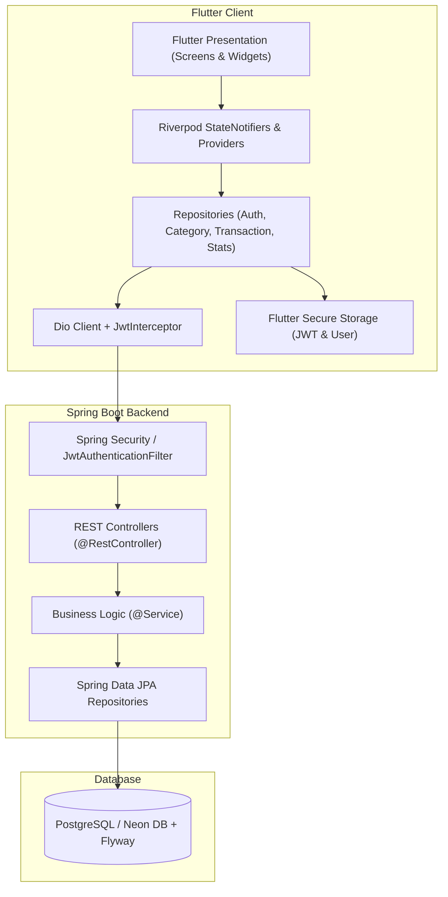
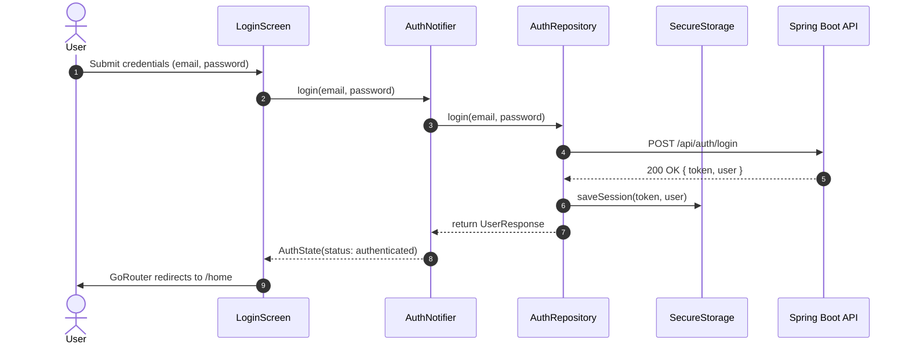
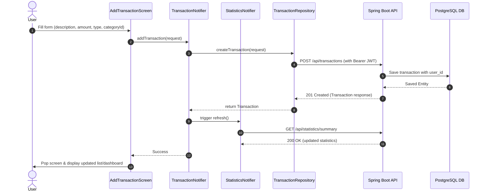

# Expense Tracker — System Architecture & Design

This document details the architectural patterns, data flow, security model, and component interactions of the Expense Tracker application across both the Flutter client and the Spring Boot REST backend.

---

## 🏗️ High-Level System Architecture

The application adopts a **Feature-First Layered Architecture** on the client side, decoupled from a stateless RESTful **Spring Boot & PostgreSQL** backend.



---

## 📱 Flutter Client Architecture (Feature-First)

The Flutter codebase is organized by business feature rather than technical layer:

```text
lib/
├── core/
│   ├── config/          # ApiConfig and environment settings
│   ├── network/         # Dio client, JwtInterceptor, AuthSessionEvent, ApiException
│   ├── router/          # GoRouter configuration & navigation guards
│   ├── storage/         # SecureStorageService (JWT/Profile)
│   ├── theme/           # AppTheme (Light/Dark M3) & ThemeProvider
│   └── utils/           # MoneyUtils & AppDateUtils
└── features/
    ├── auth/            # Data models, AuthRepository, AuthNotifier, Login/Register screens
    ├── categories/      # CategoryRepository, CategoryNotifier, Categories screen & CategoryPicker
    ├── dashboard/       # HomeScreen (Statistics Dashboard)
    ├── statistics/      # StatisticsRepository, StatisticsNotifier, models
    └── transactions/    # TransactionRepository, TransactionNotifier, screens & filter sheet
```

### Layer Responsibilities
1. **Presentation Layer**: Pure UI widgets, forms, and responsive screens. Observes Riverpod providers using `ref.watch()` and invokes user intent via `ref.read().notifier`.
2. **State / Logic Layer**: Riverpod `StateNotifier`s manage immutable state classes (`AuthState`, `CategoryState`, `TransactionState`, `StatisticsState`). Side effects (such as 401 session expiry) trigger decoupled state updates via an in-memory event stream (`AuthSessionEvent`).
3. **Data / Repository Layer**: Enforces network abstraction using Dio, maps HTTP response JSON into immutable Dart models, catches network exceptions, and translates them into domain-level `ApiException`s.
4. **Storage Layer**: Uses `flutter_secure_storage` for encrypted JWT and profile storage. Uses `shared_preferences` for non-sensitive theme settings.

---

## 🔒 Authentication & Session Flow

Authentication utilizes stateless JSON Web Tokens (JWT). The client intercepts every HTTP response to detect 401 Unauthorized states, automatically revoking local sessions without cyclic provider dependencies.



---

## 💳 Transaction Creation & State Refresh

Creating a financial transaction requires validating inputs, converting text values into exact string monetary representations, sending a POST payload, and triggering a reactive refresh of statistics and transaction lists.



---

## 🛡️ Multi-User Security & Data Ownership

Security is enforced at multiple defense layers:

1. **Client Route Guards (`GoRouter`)**: Redirects unauthenticated users attempting to access `/home`, `/categories`, or `/transactions` back to `/login`.
2. **Network Interceptor (`JwtInterceptor`)**: Automatically injects `Authorization: Bearer <token>` into protected endpoints. Skips auth headers for `/api/auth/login` and `/api/auth/register`.
3. **Backend Ownership Constraints**: Spring Security extracts the user identity directly from the signed JWT payload. All Spring Data JPA queries append `WHERE t.user.id = :authenticatedUserId` to prevent vertical and horizontal privilege escalation.
4. **Data Redaction & Sanitize Logging**: `DioClient` logs strictly in `kDebugMode`, redacting Authorization headers, passwords, and personal transaction contents.

---

## 📊 Monetary Precision & Error Propagation

- **Monetary Precision**: All monetary values are validated and stored as exact two-decimal formatted strings or numeric `BigDecimal` values on the backend, preventing IEEE 754 binary floating-point inaccuracies.
- **Error Mapping**: Raw Dio network timeouts (`DioExceptionType.connectionTimeout`) and HTTP error codes (`400 Bad Request`, `401 Unauthorized`, `403 Forbidden`, `500 Server Error`) are caught in repositories and mapped to `ApiException` instances with clean, user-friendly messages.
